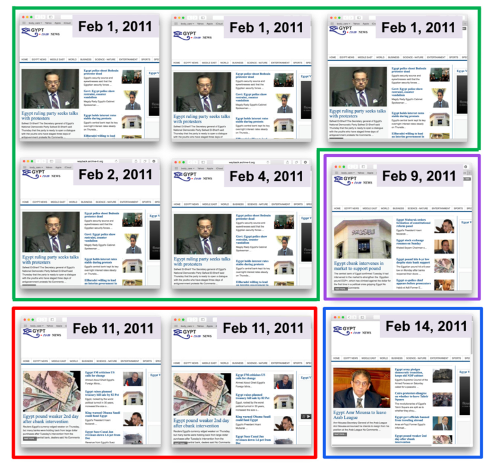
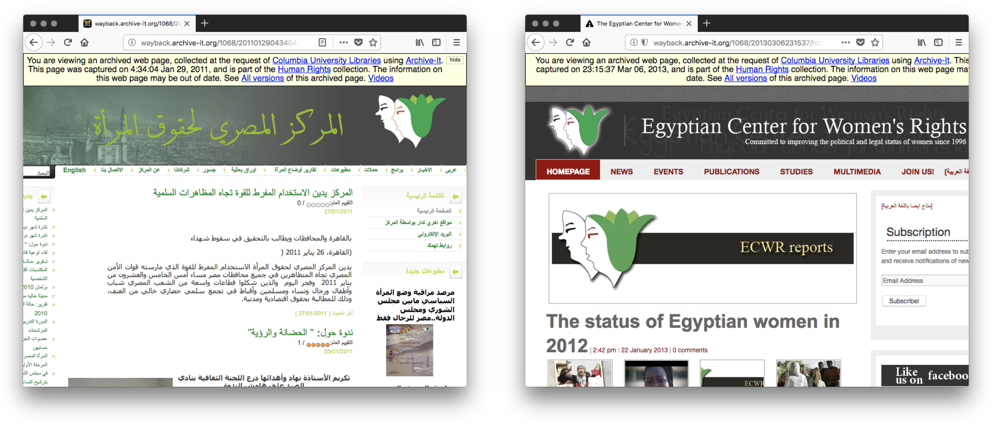

# Exercise – Automatically Generating Story Resources


Storytelling involves reduction and visualization of the large collection to some representative samples. This algorithm was developed by Yasmin AlNoamany.


> For more information on how this algorithm works, see: Y. AlNoamany, M. C. Weigle, and M. L. Nelson. 2017. Generating Stories From Archived Collections. In Proceedings of the 2017 ACM on Web Science Conference. https://doi.org/10.1145/3091478.3091508

We will use the [Off-Topic Memento Toolkit (OTMT)](https://pypi.org/project/otmt/) to help us perform this reduction.

## Step 1: Excluding Off-Topic Pages

1. Open a terminal
2. Type the following:
```
detect_off_topic -i archiveit=3649 -o 3649-otmt.json --ontopic-file 3649-ontopic.txt
```
3. When the prompt returns, the command has finished executing.

> If you see this at any time:
> 
```
/usr/local/lib/python3.6/dist-packages/sklearn/externals/joblib/externals/cloudpickle/cloudpickle.py:47: DeprecationWarning: the imp module is deprecated in favour of importlib; see the module's documentation for alternative uses
  import imp
```
> It is caused by a library used by the OTMT. This will not go away until that library releases a new version.


This command downloads the seed mementos for the collection and runs similarity metrics on these mementos to detect mementos that are off-topic. The arguments to the command above have the following meanings:

* `-i archiveit=3649` tells the OTMT to download Archive-It collection 3649, the `-i` command also takes other values, like `timemap` or `warc`
* `-o 3649-otmt.json` tells the OTMT to store output in the file `3649-otmt.json`
* `--ontopic-file 3649-ontopic.txt` tells the OTMT to place the list of mementos that are on-topic in the file `3649-ontopic.txt`

The working directory for the story files grows as the size of the collection grows. Some examples:
* a collection with 374 seed mementos takes up 35 MB
* a collection with 31,863 seed mementos takes up 3.6 GB

This can take a long time depending on the size of the collection. Some examples:
* a collection with 374 seed mementos took 1 minute, 56 seconds
* a collection with 31,863 seed mementos took 3 hours 17 minutes 11 seconds
* For this reason, we will work with output from an existing run...

> For an analysis of the Off-Topic Memento Toolkit (OTMT), see: S. M. Jones, M. C. Weigle, and M. L. Nelson. 2018. The Off-Topic Memento Toolkit. In International Conference on Digital Preservation (iPRES) 2018. https://doi.org/10.17605/OSF.IO/UBW87

## Step 2: Excluding Duplicate Mementos

Using the same terminal, type the following:
```
exclude_duplicates -i 3649-otmt.json -c 3649-ontopic.txt -o 3649-nonduplicates.txt
```
 
* `3649-otmt.json` is data about collection 3649 generated in the previous section
* The `-c` argument takes in the list of on-topic mementos stored in file `3649-ontopic.txt` generated in the previous section
* The `-o` argument stores the output in the file `3649-nonduplicates.txt` which contains the list of mementos that are not duplicates, it will be used in the next step

**Why Remove Duplicates?**

* Remember: A memento is an observation at a particular point in time
* Sometimes the web page did not change
* These duplicates are extras that we do not need in our story



The above figure contains thumbnails of duplicate mementos, grouped by color. Mementos outlined in red are the same, green are the same, etc.

## Step 3: Excluding mementos by language

Type the following:
```
select_by_language -i 3649-otmt.json -c 3649-nonduplicates.txt --lang en -o 3649-lang.en.txt
```

* `3649-otmt.json` is data about collection 3649 generated in the previous section
* `3649-nonduplicates.txt` contains the list of mementos that are not duplicates from the previous step
* `3649-lang.en.txt` contains the list of mementos that are not duplicates and are English language, it will be used in the next step

**Why keep mementos with the same language?**



We typically want to tell stories with a single language.

## Step 4: Slice the mementos by datetime

Type the following:
```
slice_by_datetime -i 3649-otmt.json -c 3649-lang.en.txt -o 3649-sliced.tsv
```

* `3649-otmt.json` is data about collection 3649 generated in the previous section
* `3649-lang.en.txt` contains the list of on-topic mementos that are not duplicates and are English language from the previous step
* `3649-sliced.tsv` contains a tab-delimited list of memento URLs and their slice numbers, it will be used in the next step

**Why slice the collection?**

To ensure we account for the spread across time, we slice the collection dynamically and distribute the mementos equally on the slices.

For N mementos:
* If |N| <= 28, then the number of slices is |N|
* If |N| > 28, then the number of slices is: ⌈ 28 + log<sub>10</sub> |N| ⌉

This way the size of the story grows slowly as needed for large collections


## Step 5: Cluster the mementos in each slice

Type the following:
```
cluster_by_simhash -i 3649-otmt.json -s 3649-sliced.tsv -o 3649-clustered.tsv
```

* `3649-otmt.json` is data about collection 3649 generated in the previous section
* `3649-sliced.tsv` contains a tab-delimited list of memento URLs and their slice numbers from the previous step
* `3649-clustered.tsv` contains a tab-delimited list of memento URLs with their slices and clusters, it will be used in the next step

**Why cluster the slices?**

To ensure we find novel mementos, we reuse the Simhash scores from the deduplication step. Each cluster is built from the distance between these Simhash scores using the DBSCAN algorithm.

## Step 6: Choose High Quality Pages From Each Cluster

* We favor pages with the following features:
  - News over social media, because social media posts produce poorer cards
  - Longer URLs with deeper paths, because they contain more unique information and thus produce better cards
  - They have low memento damage
  
**What is “Memento Damage” ?**
 
Sometimes, when crawling, a web archive does not acquire all of the images, stylesheets, or JavaScript to render a page. This lack of resources is called **damage** and is assigned a score.

> Note that calculating memento damage takes a long time, so this next step will take a while.
> Because it takes a while, we will skip the Memento-Damage step during our lesson today.
> Instead, let's visit http://memento-damage.cs.odu.edu/ for an example.

> For more information on Memento Damage, see: Brunelle, J.F., Kelly, M., SalahEldeen, H. et al. International Journal on Digital Libraries (2015) 16: 283. https://doi.org/10.1007/s00799-015-0150-6

### The Command to Select High Quality Pages

Type the following:
```
select_high_quality -i 3649-clustered.tsv --damage-uri http://localhost:8888 –o 3649-story-mementos.txt
```

> Leave out the --damage-uri http://localhost:8888 for today

* `3649-clustered.tsv` contains the list of mementos, their slices, and their clusters from the previous step
* `3649-story_mementos.txt` contains the list of memento URLs for our story

With this list, we can now visualize our story

[Back to Table of Contents](README.md)
